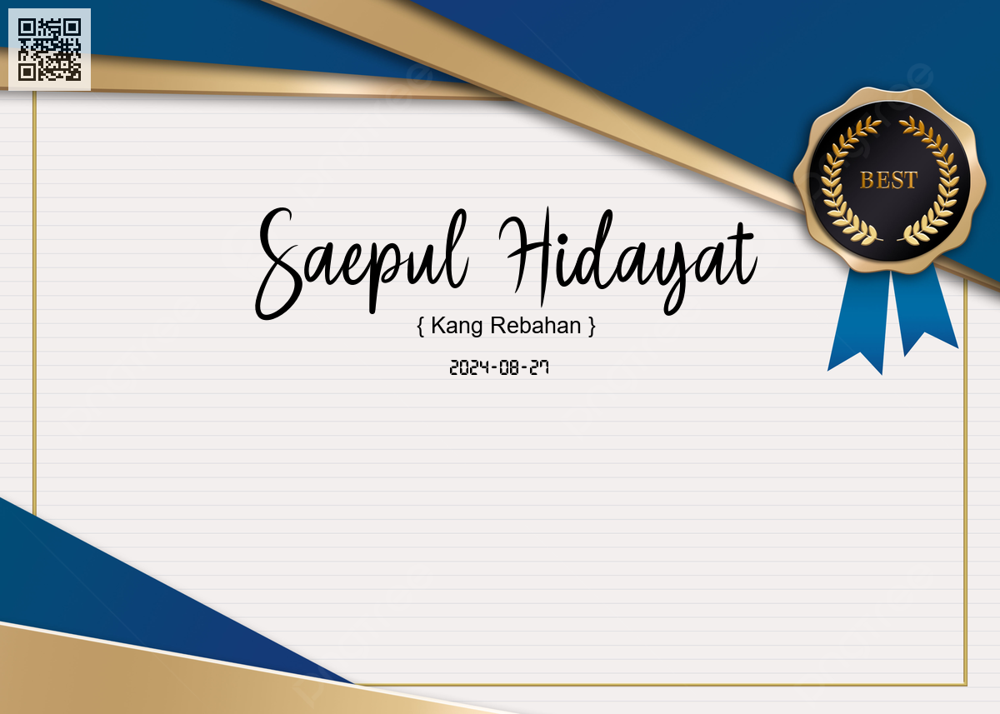

# PHP Generate Certificate

# Blank Template

# Result Certificate

# Sources
- https://www.malasngoding.com/membuat-qr-code-dengan-php/
- https://font.download/category/handwritten?sort=recent&styles=&language=&previewText=Saepul+Hidayat